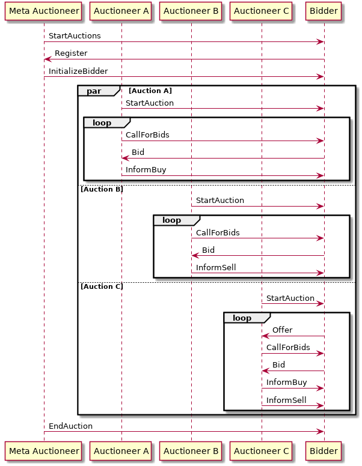

README
======

About this Package
------------------

Use this project as a starting point for implementing your bidder agent. This project contains:

- a valid pom.xml file including the JIAC dependency and repository; feel free to change the project's name if you like, or add additional libraries you might need
- a sequence diagram showing the expected message exchange between auctioneer and bidder
- the complete auctioneer agents, including AgentBean and configuration; you can use those as reference for what the auctioneer does, and how certain things can be done in JIAC, and of course for testing your bidder agent
- a very small stub for the bidder agent; basically just an empty file with some pointers where to start
- starter classes for both, auctioneer and bidder
- classes describing the different messages being exchanged between auctioneer and bidder

You should not modify any of those classes (except for the bidder agent stub, of course), otherwise your agent will most likely not work correctly in the final competition.

The Auction Protocol
--------------------

In this year's competition, the auction is split up into several specilized parts, as described in the task assignment, which we will not re-iterate here in detail. Each of those parts is described in a separate AgentBean, i.e. `AuctioneerABean`, `AuctioneerBBean`, and `AuctioneerCBean`. Additionally, there is the `AuctioneerMetaBean`, handling the bidder registration and final result evaluation phase, and an `AuctionRunnerBean` for starting new auctions in regular intervals and varying modes.

The full auction protocol (the parts relevant to your Bidder) is shown below.

### Starting the Auction

- all bidder agents should start before the auctioneer; they can start any time before, or even keep running for multiple auctions
- as soon as the meta auctioneer starts, it sends a **StartAuctions** message to the specified message group
- upon receiving the StartAuctions, the bidder knows the auctioneer's message box address and can reply with a **Register** message, including it's own bidder ID, and your unique group token
- the meta auctioneer sends the **InitializeBidder** message including the initial wallet to the bidder, and then starts the different auctions for types A, B, and C
- the respective auctioneer beans send a **StartAuction** message (not to be confused with StartAuctions above) holding the items, and the mode of that auction (e.g. fixed items, or random)
- the biddes does not have to reply to the StartAuction message, but use the message to get the auctioneers address and auctioneer ID (needed for sending bids and offers)

### Auction A: Bidding for Buying
- as long as there are more items to be sold, the auctioneer sends a **CallForBids** to all bidders, including the type of resource, the reservation price, etc.
- if a bidder is interested in buying the item, it can respond with a **Bid**
- after a fixed time, the auctioneer evaluates the bids and sends out **InformBuy** messages to each bidder, including whether the item was bought or not (but not by whom else) and at which price

### Auction B: Bidding for Selling
- each round as long as the auction is still running, the auctioneer sends a **CallForBids** to all bidders for each item bundle and its current price; note that those are calls for bids on _selling_ those item, not for _buying_ them
- if a bidder is interested in selling the item, it can respond with a **Bid**
- after a fixed time, the auctioneer evaluates the bids and sends out **InformSell** messages to each bidder, including the price at which the item was sold

### Auction C: Offering and Bidding

- at any time after the start of the auction, bidders can send **Offer** messages, offering one of their own items for sale; they can offer any combination of resources
- the auctioneer will send out a **CallForBids** message for each of those offers too all Bidders (including the one who initially offered it)
- if a bidder is interested in the item, it can respond with a **Bid**
- after a fixed time, the auctioneer evaluates the bids and sends out **InformBuy** messages to each bidder, including whether the item was bought or not (but not by whom else) and at which price
- the auctioneer will also send an **InformSell** message to the seller

### End of Auction

- once auction A ends (when all the items are sold), the auction comes to an end
- auctions B and C keep running for a few rounds before they are stopped, too
- finally, the meta auctioneer will collect and evaluate the results and send an **EndAuction** message to each bidder, announcing the winner of the auction as a whole as well as their final Wallet

General Tipps and Advice
------------------------

- the auctioneer switches between different phases, e.g. for bidding, for evaluation, etc.; each of those phases lasts a certain amount of time; after that time is up, no more bids will be accepted until the next bidding phase
- different properties of the auctioneer can be set in the Spring configuration file, e.g. the number of items to sell, or the minimum offer for each item; you can change those parameter and see how your bidder reacts
- you can try to implement different bidder agents, following different strategies, and let them bid against each other
- if you do so, try to think of a way to separate the implementation of the auction protocol from the bidding logic, so that parts of the BidderBean can be reused
- there are different auction types A, B, and C, each implemented in a separate agent beans, which are communicating via the agent's memory; you can do the same for your bidder agent, or have the logic for handling the different auctions all in one bean
- you are free to implement only some of the auctions, e.g. if you never use auction A, or if you use auction C only for bidding _or_ selling items, that's okay; however, in order to stay competitive it is highly recommended to make use of all three auctions
- you can offer any combination of resources in auction C, but only one item per turn
- the auctioneer agents will send some messages to their respective message group, some to all registered bidders, and some just to one specific bidder; however, it will not react to any messages directed to the auctioneer's message group, but only to messages directed directly to itself; thus, do not send messages to the auctioneer message groups -- but keep in mind that other bidder agents might do so!
- note that each auctioneer can have a different or the same communication address, so to ensure that the message reaches the correct auctioneer, you should always send the message to the correct address and using the respective auctioneer ID
- each bidder agent has a bidder ID, which you can chose (e.g. to indicate bidders using different strategies), and a unique group token, which will be given to you for the final competition; in each auction, there must not be more than one bidder agent with the same bidder ID or group token, i.e. try to come up with a unique bidder ID, and do not start more than one of your bidder agents at once
- of course, you can, and should, use more than one bidder agent while testing; in this case, just give them different group tokens; the group tokens are only relevant in the final competition, but the auctioneer will always check whether there are duplicate group tokens

Final Competition
-----------------

At the very end of the course, there will be a competition where you can pit your bidder agent against the other groups' agents. For this, we will set up an auctioneer agent on one of our servers, to which you will have to connect. Detailled instructions will follow.

